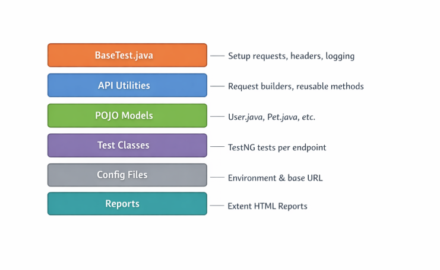
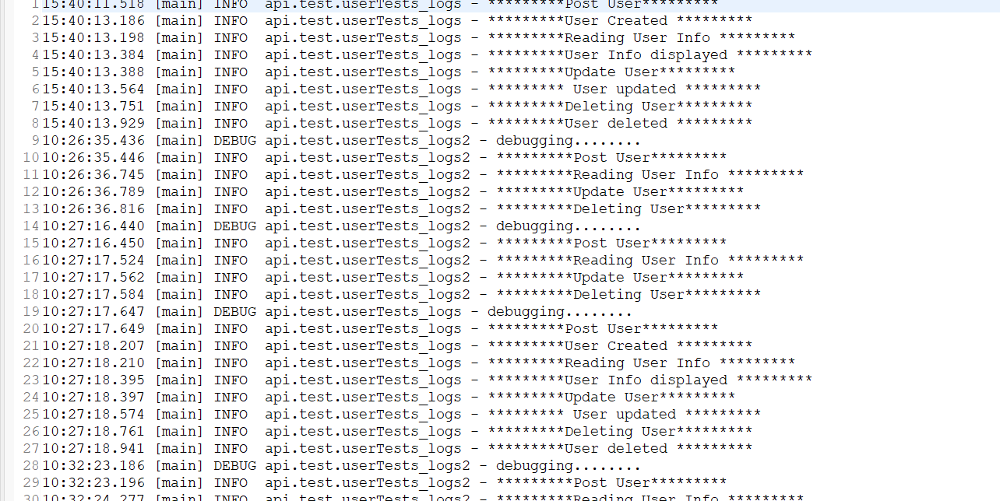
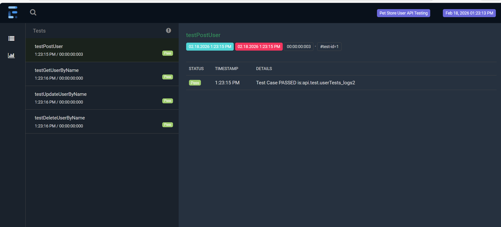

# Enterprise-Ready API Automation Framework

## Overview
This is a **scalable, maintainable API automation framework** built using **Java + Rest Assured + TestNG + Maven**, 
It includes **CI integration, HTML reporting, logging, and reusable design patterns** suitable for enterprise-level API testing.
This framework has been demonstrated on the [Swagger Petstore User API](https://petstore.swagger.io/v2/user). 

---

## Key Features
- **Ready-to-use REST Assured API framework** 
- **Environment support: dev, QA, prod**  
- **HTML reporting with Extent Reports**  
- **Detailed logging for requests and responses** 
- **CI/CD ready (Jenkins / GitHub Actions)** 
- **Modular, reusable design patterns for easy extension**   
- **Supports data-driven tests and configuration management** 

---

## Tech Stack
- **Java** - Programming language  
- **Rest Assured** - API automation  
- **TestNG** - Test framework  
- **Maven** - Build & dependency management  
- **Extent Reports** - HTML reporting  
- **Logging** - Log4j / slf4j  
- **CI/CD Integration** - Jenkins / GitHub Actions  

---

## Installation & SetUP
1. **Clone the Repository:**
   ```bash
   git clone https://github.com/yourusername/api-automation-framework.git
2. **Open the project in IDE(Intellij/ Eclipse)**
3. **Configure your environment in config. properties(dev/qa/prod)**
4. **Run tests using Maven**
	-	mvn clean test
5. **View Exten Reports in: **
	- target/extent-reports/

---

## Framework Architecture


## Logging
This framework includes detailed logging for each API request and response.  
Example log output:  


### View Reports
- Open `target/extent-reports/` to see HTML reports  
- Example report screenshot:  



